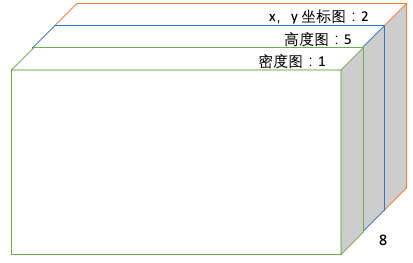

# deep lidar model for ground segment
本项目使用深度学习模型进行地面分割，以期替换掉原来的`ray segmentor`方法，下面将从数据集生成、模型结构及参数、模型训练及评估、实验结果等方面分别介绍。

## 数据集生成
本实验使用的的数据主要是点云数据，点云数据和grid的gt结果获取需要通过播包产生。主要代码见`utils/play_bag_and_perception.py`，该脚本需要在`fabupilot`的docker环境下运行。`fabupilot`的配置可参考[fabupilot](http://git.fabu.ai/fabupilot/fabupilot/blob/master/README.md)，注意事项如下：
1. `fabupilot`使用`master`分支。
2. `perception_v2`相关的有两个分支，随着master分支的不断更新，后续可能会出现问题，需要定期与master同步：
    1. `local_map_master_20221204`分支，基于master的，用于获取32线车辆的gt
    2. `local_map_howo_v4_20221204`分支，基于`local_map_master_20221204`，增加了对howo四期车的修改，主要为支持两个front补盲雷达，而不是head_right，以及`perception.conf`,`adapter.conf`, `dag_port`的更新
3. release拉`master/HEAD`。
4. `fabupilot_config/vehicle_type_configs/howo/custom_config/modules/perception_v2/conf/obstacle/lidar/ray_segmentor_config.pb.txt`中`x_backward`改为0。
4. 若要修改x,y的范围或者grid的大小，需要修改几个配置文件：

    `modules/perception_v2/conf/obstacle/lidar/ray_segmentor_config.pb.txt`,

    `modules/perception_v2/conf/obstacle/lidar/hdmap_segmentor_config.pb.txt`,
    
    `modules/perception_v2/conf/obstacle/lidar/local_map_config.pb.txt`

生成的gt并不准确，部分帧包含噪声，主要包括三种问题：
1. 雨雾天的时候，每个包的初始帧（可能几十帧，也可能上百帧）会把包含雨雾grid误检，需要丢弃这些帧。
2. 每个包中会有少数帧的第三象限全部漏检，可以通过判断第三象限的gt grid的数量丢弃这些帧。
3. 有的帧当集卡接近原点时，车头会出现漏检现象（gt能检测出来这些grid，但是被is_obstacle=0 and isinvalid=1忽略了），可以借助fusion map的检测结果去掉这些帧（如果检测框中漏检的gt大于某值，则去掉该帧）。
由于gt的一些帧和fusion map的一些帧匹配不上，这些帧也一并删除了。代码见`utils/find_lost_truckheader_frames.py`。

通过上述步骤可以生成模型需要的数据，对于每一帧，可以得到其对应的点云数据和gt数据。

得到的gt为txt文件，其内容示例如下：
```
90 125 1 1 0 1 1 1
90 181 1 1 0 1 1 1
90 182 1 1 0 1 1 1
```
每个位置代表的含义为：
```
row,  col,  grid.is_obstacle,  grid.is_static_obstacle,  grid.is_invalid,  grid.margin_left,  grid.margin_right,  grid.margin_close
```
用到的主要是row, col, is_obstacle, is_invalid四个属性。


为了对比baseline结果，需要得到ray segmentor的分割结果，同样需要播包完成。fabupilot和perception_v2都使用master分支，
要添加一些代码保存ray segmentor的结果，主要修改参考`diff_log_baseline`。

播包得到的原始数据位于`/mnt/yrfs/yanrong/pvc-80688cb9-3d14-45f4-9be0-f37238d68d83/personal/linyuqi/grid_benchmark0503_300x300`目录下，各个文件夹的含义如下：
```
grid_benchmark0503_300x300：训练数据的来源（但是未经处理，含有很多噪声帧）
grid_benchmark0503_300x300_val：测试数据的来源（但是未经处理，含有很多噪声帧）
grid_benchmark0503_300x300_badcase：一些含有问题的包，需要可视化验证
```
每个包中包括以下几项内容：
```
gt：二分类的gt
pcd：二分类的点云数据
obstacle_gt_fine：多分类的gt（0.5x0.3,300x300)
pcd_fine：多分类的点云
```

目前已有的二分类训练和测试数据位于`/mnt/yrfs/yanrong/pvc-80688cb9-3d14-45f4-9be0-f37238d68d83/personal/linyuqi/data/pc_bev_2classes0503_300x300`目录下。
（已经去除了质量差的帧，较为干净）。训练集中有的帧以extra_开头，是对雨雾天的帧进行过采样得到的，可用可不用。

0.1x0.1的多分类数据在`/private/personal/linyuqi/grid_benchmark0101_1500x900`目录下，
多分类训练目录在`/private/personal/linyuqi/gpu12/mmsegmentation/data`下。

## 模型结构及参数

### bev特征图概述
我们将点云数据转化为BEV特征图（Bird-Eye View Map）输入模型。BEV特征图通过鸟瞰的方式，用肉眼可以分辨的方式可视化ground truth、检测结果，并做直观的评估，更符合我们的观测习惯。

我们的BEV特征图的尺寸是（190，200，8），下面将用HWC的格式说明。在把点云转移到特征图时，我们以lidar为原点，以车行进方向为x轴的正向，以车左侧为y轴的正向，以地面向上的方向为z轴的正向。反应在上图中，x轴的正向为水平向右，y轴的正向为垂直向上，z轴的正向为从屏幕内垂直朝屏幕外。x轴方向上，我们关注-5m到90m的范围；y轴方向上，我们关注-30m到30m的范围。我们以边长为0.5x0.3m的小方格将鸟瞰图划分，得到一个高（y轴）为60/0.3=200，宽（x轴）为95/0.5=190的二维图。

这里特别注意的是，车自身也有一定的长和宽，我们不关注在车自身范围附近的点。具体指标是我们不关注同时落在x轴-7.18m到2.0m，y轴-1.85m到1.85m的点。

根据点云中每个点的x，y坐标，我们可以找到它们对应BEV特征图中的坐标。

BEV特征图的深度为8，由5张高度图、1张密度图和2张标准化之后的x，y坐标图组成。每张高度图、密度图和标准化坐标图的尺寸均为190x200。



### 高度图
我们关注在真实世界中高度-0.3m到2.2m的范围，因为大多数轿车、卡车、行人、非机动车的高度都在这个范围内。取了负值是因为有的点会出现下沉的情况，导致实际坐标在地面以下。

我们把3.0m的高度范围分成5份，每个高度范围是0.5m，这5份水平切割的高度范围对应了5张高度图。每张高度图中每个方格的值记录了落在该方格中所有点的最大相对高度（最大高度在范围内的绝对值/高度范围）。

p.s.:最初使用的高度是[-1,2]，最终发现[-0.3,2.2]效果更好，代码中有些实验做得比较早，其config可能还是[-1,2]，可以按需修改。

### 密度图
密度图反映了每个方块中点的密集程度。在概述部分我们已经介绍了如何把点分到每个方格中。根据这样的分法，我们可以得到每个方格中的点的数量。利用下面的公式，我们可以计算每个方格的密度。其中N是方格中点的数量；分母中的8是一个标准化参数，可以根据实际情况调整。
```math
min(1.0,log(N+1)/log(8))
```
p.s.:最初使用的高度是[-1,2]，log_norm=4，最终发现[-0.3,2.2]效果更好，对应使用的log_norm=8,代码中有些实验做得比较早，其config可能还是log_norm=4，可以按需修改。

| 4373frames | IOU | precision | recall | f1-score |
| --- | --- | --- | --- | --- |
| bev[-1,2] | 0.776 | 0.886 | 0.861 | 0.873 |
| bev[-0.3,2.2] | 0.794 | 0.897 | 0.872 | 0.884 |

### 标准化坐标图
BEV特征图的剩下两个深度分别给了标准化后的x和y坐标图。标准化的坐标图是通过将每个像素点的x坐标和y坐标除以总长或者总宽得到的。


## 模型训练及评估

### 环境配置
* Python3.9
* torch==1.7.1+cu101
* torchvision==0.8.2+cu101
* pytorch-lightning==1.1.0
* prettytable
* open3d
* imageio
* opencv-python
* numba
* scikit-image

本实验所需环境已打包成docker文件，可通过如下命令启动并进入：
```
#加载镜像压缩包，注意gpu12和gpu13已包含该镜像，可省略
docker load -i /mnt/yrfs/yanrong/pvc-80688cb9-3d14-45f4-9be0-f37238d68d83/personal/linyuqi/deep_grid/deep_lidar_pl.tar
# 挂载路径根据需要修改或者添加
docker run --name deep_lidar_test -v /mnt:/mnt  --shm-size 6G --gpus all -idt deep_lidar_pl
# 进入docker
docker exec -it deep_lidar_test /bin/bash
```
如果需要重新配置环境，可参考如下指令：
```
pip config set global.index-url https://pypi.tuna.tsinghua.edu.cn/simple
pip install torch==1.7.1+cu101 torchvision==0.8.2+cu101 -f https://download.pytorch.org/whl/torch_stable.html
pip install pytorch-lightning==1.1.0  prettytable  open3d imageio opencv-python numba scikit-image
```

### 训练
```
python train_bev.py
```
具体参数在`config.py`和`train_bev.py`中设置。

目前使用的二分类模型位于`/mnt/yrfs/yanrong/pvc-80688cb9-3d14-45f4-9be0-f37238d68d83/personal/linyuqi/deep_grid/deep_grid_0627.ckpt`

### 测试
```
python eval_bev.py
```
包括生成预测结果、速度测试等功能。

### 可视化
可视化代码可参考`utils/grid_vis_xxx.py`

### 评估
给出gt和pred的结果（txt），在evaluation中可以进行多角度的评估，包括全图评估（eval.py），按范围评估（eval_range.py），
不考虑被遮挡的grid（eval_per_file_with_occlusion_mask.py）等。将pred的结果替换为线上baseline的结果可用于评估baseline。


## 结果展示
模型的训练数据约为96k，测试数据约为4.3k，在测试数据上的结果如下：

### 准确率

**常规帧（非雾天）**

| 3536frames,no fog | IOU | precision | recall | f1-score |
| --- | --- | --- | --- | --- |
| baseline | 63.61 | 95.57 | 65.58 | 77.72 |
| deep model | 78.06 | 89.27 | 85.99 | 87.63 |
| baseline(occ mask) | 84.67 | 98.81 | 85.84 | 91.68 |
| deep model(occ mask) | 92.69 | 96.35 | 96.01 | 96.18 |

**雾天**

| 837frames,no fog | IOU | precision | recall | f1-score |
| --- | --- | --- | --- | --- |
| baseline | 51.45 | 59.75 | 80.02 | 67.95 |
| deep model | 84.61 | 91.38 | 91.91 | 91.64 |
| baseline(occ mask) | 71.37 | 74.84 | 93.62 | 83.17 |
| deep model(occ mask) | 94.14 | 96.42 | 97.52 | 96.97 |

**综合**

| 4373frames,no fog | IOU | precision | recall | f1-score |
| --- | --- | --- | --- | --- |
| baseline | 61.18 | 88.29 | 68.46 | 75.77 |
| deep model | 79.37 | 89.69 | 87.23 | 88.43 |
| baseline(occ mask) | 82.01 | 94.01 | 87.15 | 89.97 |
| deep model(occ mask) | 92.98 | 96.36 | 96.31 | 96.33 |

**按范围评估（inner:x:[-5,30],y:[-30,30]  outer:inner之外**

**非雾天**

| 3536frames | IOU | precision | recall | f1-score |
| --- | --- | --- | --- | --- |
| baseline_inner | 74.75 | 95.36 | 77.61 | 85.53 |
| deep model_inner | 82.2 | 90.99 | 89.42 | 90.19 |
| baseline_outer | 43.73 | 95.99 | 44.60 | 60.69 |
| deep model_outer | 71.14 | 86.13 | 80.22 | 83.06 |

**综合**

| 4373frames | IOU | precision | recall | f1-score |
| --- | --- | --- | --- | --- |
| baseline_inner | 70.23 | 87.59 | 79.56 | 82.13 |
| deep model_inner | 83.56 | 91.61 | 90.39 | 90.99 |
| baseline_outer | 44.32 | 95.83 | 45.24 | 61.28 |
| deep model_outer | 70.47 | 84.85 | 80.44 | 82.55 |

### 速度测试

| stage | time |
| --- | --- |
| load pcd | 200ms |
| transform to bev | 5ms |
| model inference | 26ms |


### 可视化

**deep model  V.S.  gt  V.S.  baseline**


**deep model  V.S.  baseline（蓝色：deep model和baseline都检测为障碍物，红色：deep model未检测出，baseline检测出，绿色：deep model检测出，baseline未检出**


**deep model  V.S.  gt（蓝色：deep model和gt都检测为障碍物，红色：deep model未检测出，gt检测出，绿色：deep model检测出，gt未检出**


# DG
# DG
